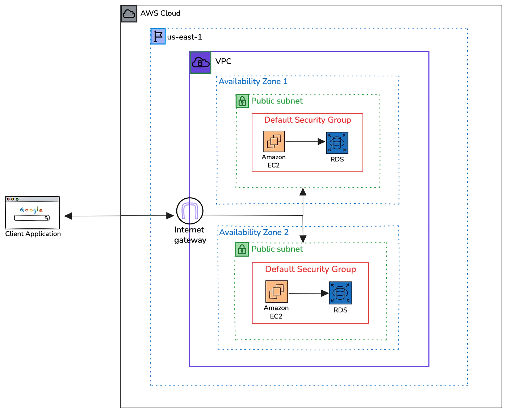
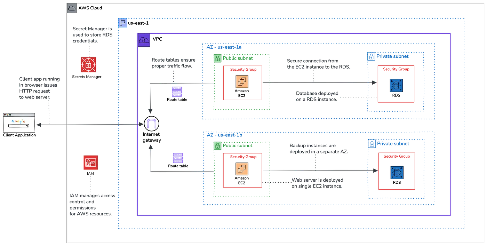

# 🏥 AWS Infrastructure Migration with CDK (Healthcare Platform Modernization)

This project demonstrates how legacy AWS infrastructure originally built through the AWS Management Console can be migrated to Infrastructure as Code using AWS CDK.

The goal of the migration is to improve **repeatability, security, and maintainability** by replacing manual configuration with automated, version-controlled infrastructure.

📖 **Architecture Deep Dive (Medium Article):**  
[From Console Chaos to CDK Control: Modernizing Healthcare Infrastructure on AWS](https://medium.com/@psalvador8/from-console-chaos-to-cdk-control-modernizing-healthcare-infrastructure-on-aws-a78f98049e2c)

---

# 📌 Project Overview

Many organizations initially build their infrastructure manually using the AWS Console.

While this approach can work for early experimentation, it creates long-term challenges such as:

- infrastructure drift  
- lack of reproducibility  
- undocumented configuration  
- inconsistent security policies  
- difficulty creating new environments  

This project demonstrates how to modernize a **healthcare web application infrastructure** by rebuilding it using **AWS Cloud Development Kit (CDK)**.

The migration introduces:

- Infrastructure as Code
- version-controlled infrastructure
- improved networking and security architecture
- automated infrastructure deployment

This approach transforms manually configured resources into a **programmable, repeatable cloud architecture**.

---

# 🧭 Architecture

This project illustrates the transformation from a manually configured AWS environment to a modern **Infrastructure-as-Code architecture using AWS CDK**.

---

## Legacy Architecture (Before Migration)



The original environment was provisioned manually through the AWS Management Console.

While the system functioned correctly, this approach introduced several operational challenges:

- Infrastructure configuration was not version-controlled
- Environment replication was difficult
- Security policies could drift over time
- Manual changes increased operational risk
- Infrastructure documentation was limited

These issues made the environment harder to maintain and scale.

---

## Modernized Architecture (After Migration)



The infrastructure was rebuilt using **AWS CDK**, enabling programmatic infrastructure definition and repeatable deployments.

Key architectural improvements include:

- Infrastructure defined as code using AWS CDK
- Version-controlled infrastructure deployments
- Consistent networking architecture
- Improved security segmentation
- Automated environment provisioning

This modernization significantly improves the **maintainability, scalability, and reliability** of the infrastructure.

---

# 🧰 Technologies Used

- AWS CDK (TypeScript)
- Amazon VPC
- Amazon EC2
- Amazon RDS (MySQL)
- IAM
- AWS CloudFormation
- Node.js
- TypeScript

---

# ⚙️ Deployment Strategy

Infrastructure is defined using **AWS CDK**, which synthesizes infrastructure code into **CloudFormation templates**.

The deployment workflow includes:

1. Writing infrastructure definitions using CDK constructs  
2. Synthesizing CloudFormation templates  
3. Deploying resources using the AWS CDK CLI  
4. Managing infrastructure updates through version-controlled code  

This process allows infrastructure to be deployed consistently across multiple environments.

---

# 🚀 Quick Deployment

### Prerequisites

- AWS account  
- AWS CLI configured  
- Node.js installed  
- AWS CDK installed  

Install AWS CDK globally:

```
npm install -g aws-cdk
```

Install project dependencies:

```
npm install
```

Deploy the infrastructure:

```
cdk deploy
```

CDK will synthesize the CloudFormation templates and provision the infrastructure.

---

# 🛟 Reliability & Scalability

The architecture incorporates several cloud-native reliability practices:

- multi-AZ infrastructure support
- private subnet isolation for backend services
- managed database service (Amazon RDS)
- security group segmentation
- infrastructure defined as code for consistent deployments

These improvements significantly increase operational reliability compared to manual infrastructure management.

---

# 🧠 Design Decisions

Several architectural decisions were made during the migration process.

- **AWS CDK** was selected to define infrastructure programmatically using TypeScript.
- **Custom VPC architecture** provides network isolation between public and private resources.
- **Private subnets** protect backend services from direct internet exposure.
- **Security groups** enforce least-privilege network access.
- **Infrastructure as Code** enables repeatable and auditable deployments.

These decisions transform the environment from manual configuration to **automated infrastructure management**.

---

# 🏗️ System Design Principles

This project reflects several core cloud engineering principles.

### Infrastructure as Code

Infrastructure is defined programmatically and managed through version control.

### Security by Design

Private networking and controlled access improve the security posture of the system.

### Reproducibility

Entire infrastructure environments can be recreated from code.

### Maintainability

Infrastructure changes are managed through source control rather than manual console updates.

### Automation

Infrastructure provisioning becomes part of an automated deployment workflow.

---

# 🎯 What This Project Demonstrates

- Migrating console-based infrastructure to Infrastructure as Code
- AWS CDK infrastructure development
- Secure VPC networking architecture
- Private subnet design for backend services
- Infrastructure version control and automation
- Modern cloud infrastructure management practices

---

# 🚀 Potential Improvements

Future enhancements could include:

- implementing Auto Scaling Groups
- adding an Application Load Balancer
- integrating CI/CD for infrastructure deployment
- adding monitoring with CloudWatch dashboards
- implementing automated security auditing

---

# 📁 Repository Structure

```
├── README.md
├── bin/
│   └── app.ts
├── lib/
│   └── infrastructure-stack.ts
├── package.json
├── cdk.json
└── docs/
    ├── legacy-architecture.png
    └── cdk-architecture.png
```

---

# 💡 Key Takeaway

Migrating infrastructure from manual console configuration to Infrastructure as Code dramatically improves reliability, security, and maintainability.

Using AWS CDK allows engineers to treat infrastructure as software — enabling version control, automation, and repeatable deployments.

---

# 👤 Author

**Priscilla Salvador**  
Cloud & DevOps Engineer
